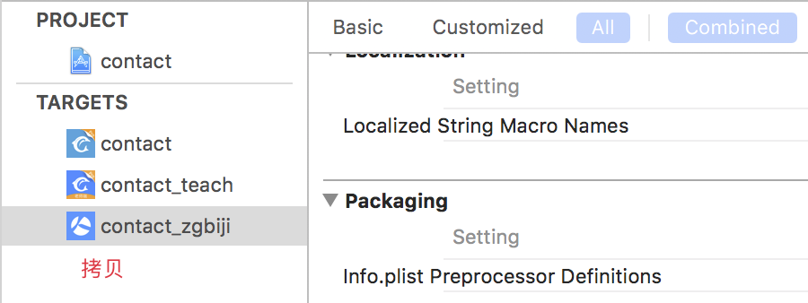
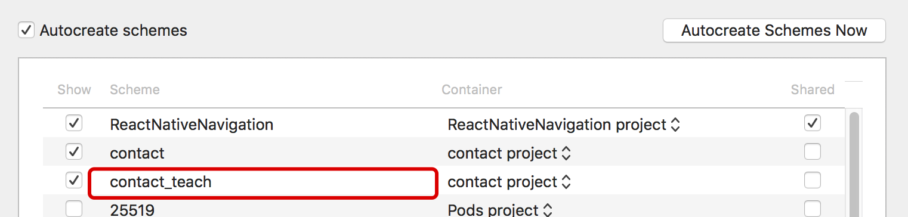
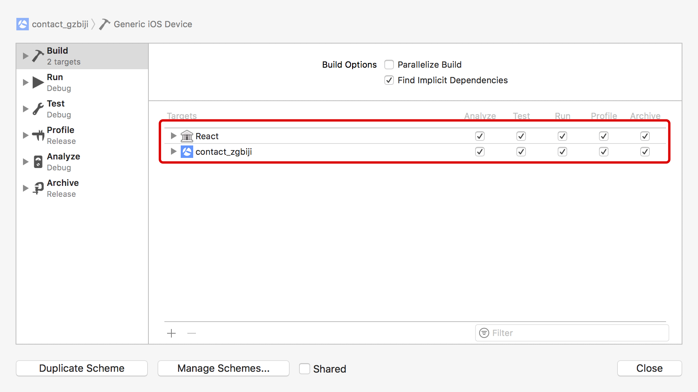
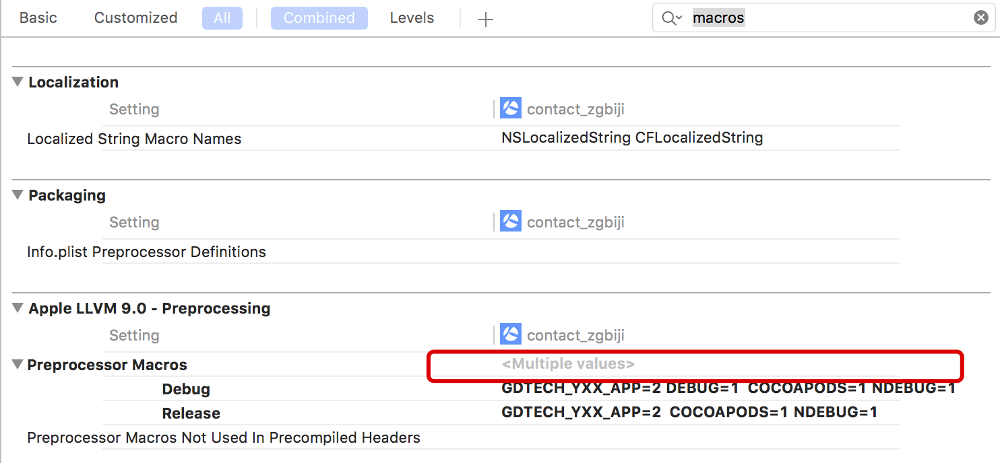
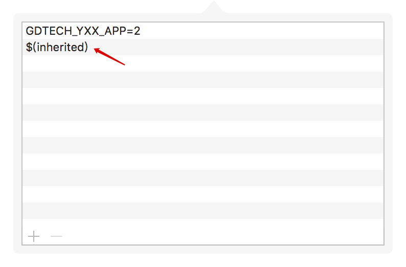
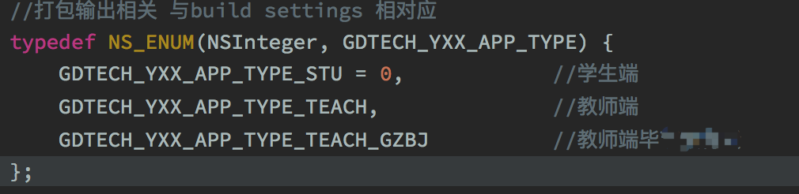
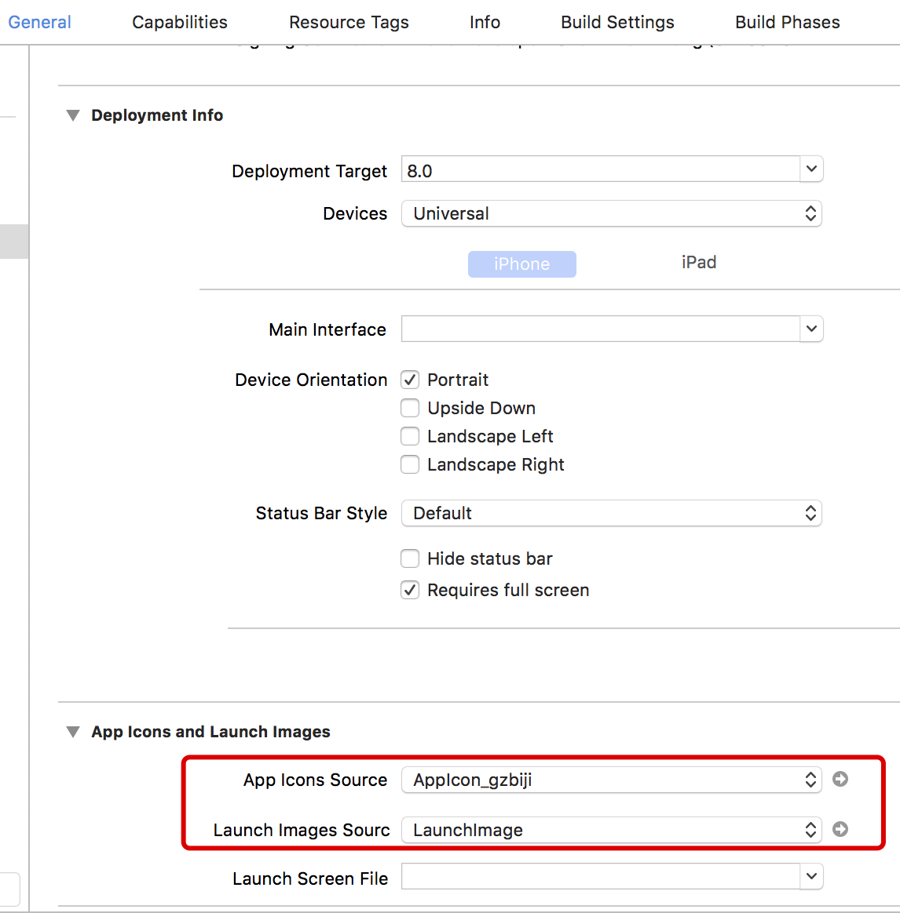
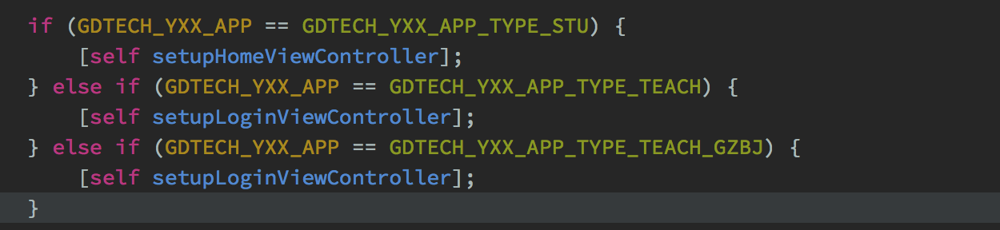
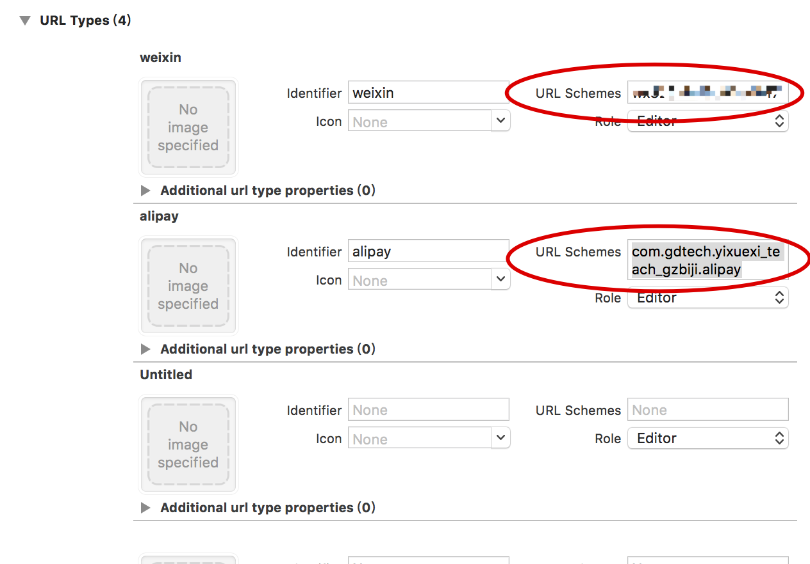

##### 一、创建项目

1、在Apple后台新建项目，如有跳过。

2、创建推送证书

##### 二、新建target

1、拷贝项目

拷贝target项目，回车重命名target名字

同时需要重命名schemes中的项目名字 ，选择项目，回车进行重命名

设置build中的 parallelize Build ,添加React，且将React置于项目名前，取消Parallelize Build勾选

拷贝target项目的同时会生成plist文件，回车进行重命名

拷贝config.json文件（项目自定义添加，方便配置一些项目的参数）

##### 三、配置项目

1、plist文件 修改项目名、bundleID 等

2、在build Settings 中搜索 macros 添加target项目标识 ，双击红色框，添加标识，保证标识在红色箭头的后面

3、 修改宏文件中，枚举类型与刚刚添加的target标识一致

4、配置images

在image.xcassets中添加应用图标、应用启动图标、登录页面等logo，选择相应的target修改应用标题，启动页面指向

5、修改项目中不同target的配置逻辑

6、修改URL Types 

7、修改config.json文件

修改 、APP_BASR_URL、微信ID（配置文件中，同时需要修改项目中的）、支付宝ID（项目中）等

8、配置pod 文件，增加target

9、修改隐私文件、用户协议

10、AFNetworking 【embed&sign】
